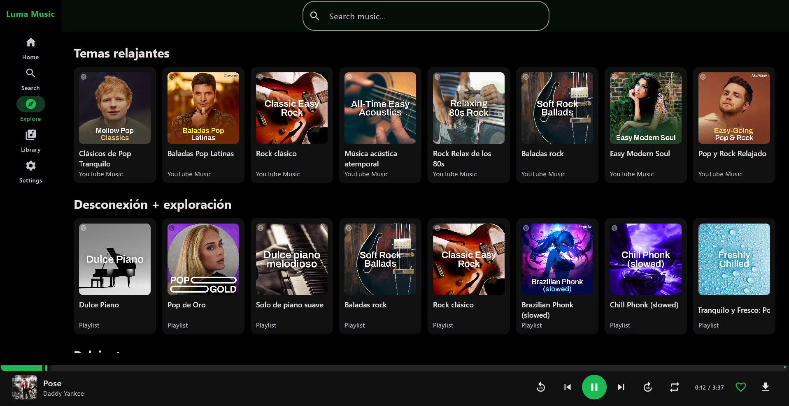

<p align="center">
  
</p>

<h1 align="center">Luma Music</h1>

Desktop client for YouTube Music, built with **Kotlin** and **Compose Multiplatform (Compose Desktop)**.

Luma Music is a desktop port of the [OpenTune](https://github.com/Arturo254/OpenTune) Android app (by Arturo254), reusing its `innertube` module to talk to YouTube Music.

## 📸 Captures



## Features

- Browse home, search and explore (moods & genres) content
- Play songs and albums with a full queue (sequential, shuffle, loop)
- Animated equalizer indicator on the currently playing song
- Download songs for offline playback
- Offline library: liked songs, downloads and audio cache tabs
- 21 color palettes + pure black AMOLED theme
- Fullscreen player mode
- Persistent settings, cache and library (stored under `~/.opentune/`)

## Requirements

- JDK 21
- [yt-dlp](https://github.com/yt-dlp/yt-dlp) (for audio download)
- [ffmpeg](https://ffmpeg.org/) (for audio conversion)

## Build & run

```bash
./gradlew composeApp:run
```

On Windows, use `gradlew.bat`:

```bat
gradlew.bat composeApp:run
```

Build a distributable package:

```bash
./gradlew composeApp:packageDistributionForCurrentOS
```

## Project layout

- `composeApp/` — the desktop UI and player (Compose Desktop)
- `innertube/` — YouTube Music API client (from the original OpenTune project)

## Data & privacy

Settings, liked songs, downloads metadata and audio cache are stored locally under `~/.opentune/`.

## License

GPL-3.0. The `innertube` module is originally from [OpenTune](https://github.com/Arturo254/OpenTune) (GPL-3.0).
