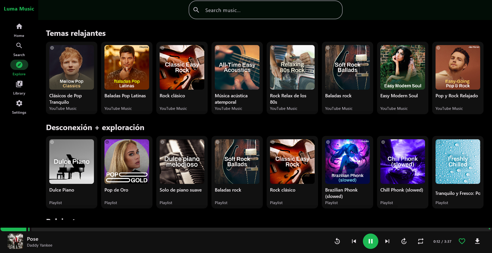

<p align="center">
  
</p>

<h1 align="center">Luma Music</h1>

<p align="center">
  <a href="https://discord.gg/YymhhUy4fH">
    
  </a>
</p>

Cliente de escritorio para YouTube Music, construido con **Kotlin** y **Compose Multiplatform (Compose Desktop)**.

Luma Music es una versión de escritorio de la app de Android [OpenTune](https://github.com/Arturo254/OpenTune) (de Arturo254), reutilizando su módulo `innertube` para comunicarse con YouTube Music.

## 📸 Capturas



## Funciones

- Navega por el inicio, busca y explora contenido (estados de ánimo y géneros)
- Reproduce canciones y álbumes con cola completa (secuencial, aleatorio, bucle)
- Indicador de ecualizador animado en la canción en reproducción
- Descarga canciones para escucharlas sin conexión
- Biblioteca sin conexión: canciones favoritas, descargas y caché de audio
- 21 paletas de colores + tema AMOLED negro puro
- Modo de pantalla completa
- Configuración persistente, caché y biblioteca (guardadas en `~/.opentune/`)

## Requisitos

- JDK 21
- [yt-dlp](https://github.com/yt-dlp/yt-dlp) (para descargar audio)
- [ffmpeg](https://ffmpeg.org/) (para convertir audio)

## Compilar y ejecutar

```bash
./gradlew composeApp:run
```

En Windows, usa `gradlew.bat`:

```bat
gradlew.bat composeApp:run
```

Compila un paquete distribuible:

```bash
./gradlew composeApp:packageDistributionForCurrentOS
```

## Estructura del proyecto

- `composeApp/` — la UI de escritorio y el reproductor (Compose Desktop)
- `innertube/` — cliente de la API de YouTube Music (del proyecto original OpenTune)

## Datos y privacidad

Los ajustes, canciones favoritas, metadatos de descargas y caché de audio se guardan localmente en `~/.opentune/`.

## Firma de código

Los lanzamientos de Windows se firman con un certificado proporcionado por [Necessary Code Signing](https://sign.necessary.nu). Esto elimina los avisos de SmartScreen cuando los usuarios descargan Luma Music.

Firma de código gratuita proporcionada por Necessary Code Signing.

Ver [CODESIGN.md](CODESIGN.md) para más detalles.

## Licencia

GPL-3.0. El módulo `innertube` proviene originalmente de [OpenTune](https://github.com/Arturo254/OpenTune) (GPL-3.0).
